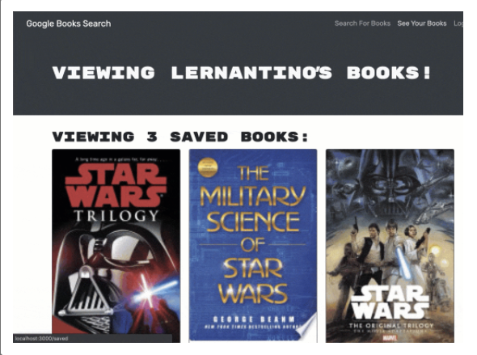

# book-search
  
  ## Description
  This full stack MERN Application uses MongoDB, React, GraophQL and Apollo server. It functions as a book search engine where logged in users can save a list of books they would like to read.

  
  
  ## Table of Contents
  * [Installation](#installation)
  * [Usage](#usage)
  * [License](#license)
  * [Contributing](#contributing)
  * [Tests](#tests)
  * [GitHub](#github)

  ## Installation
  Clone repository from GitHub and install dependencies with `npm install`. To use the local version run `npm run develop`. Otherwise, use the deployed version: https://google-book-search95.herokuapp.com/

  ## Contributing
  This project follows the Contributor Covenant.  
  

  ## Questions
  Reach out via email or GitHub.  
  cassie.s.simpson@gmail.com  
  [cassie-s](https://github.com/cassie-s/)

  

